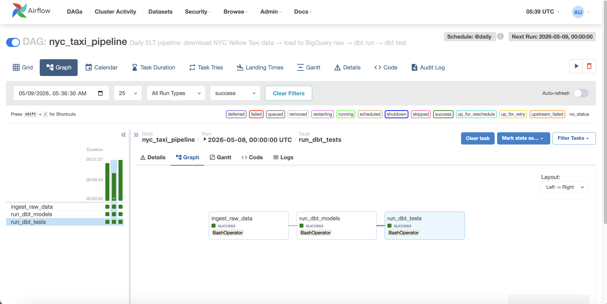
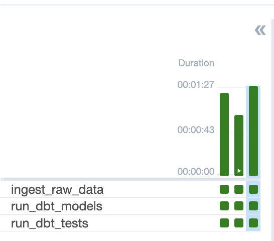
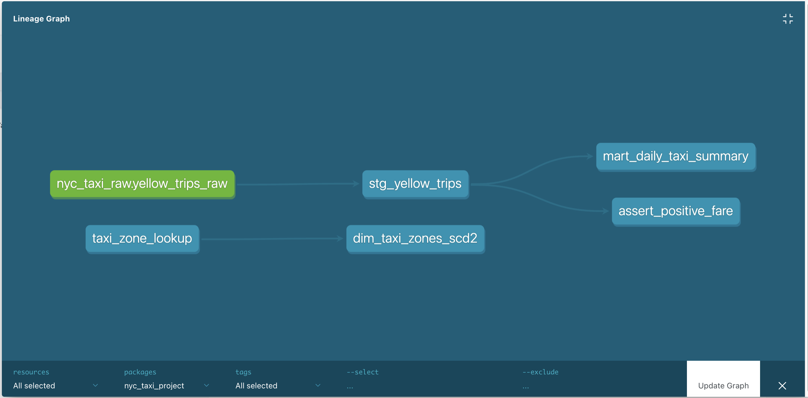
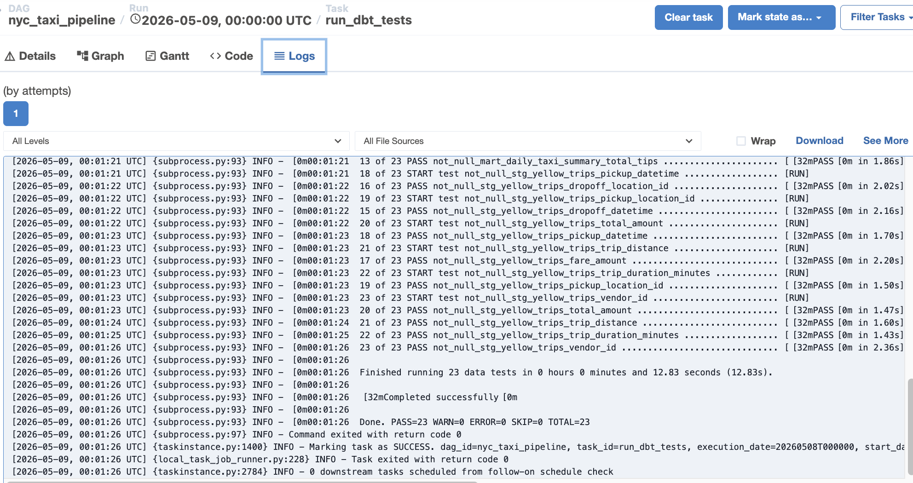
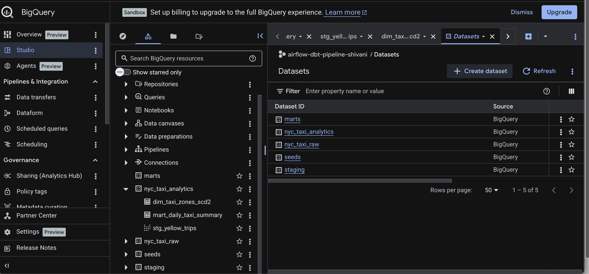
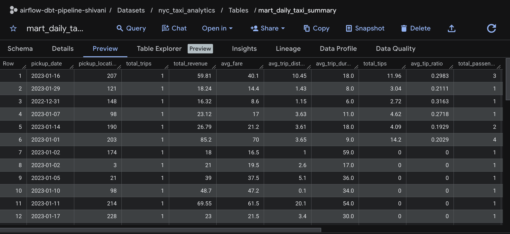
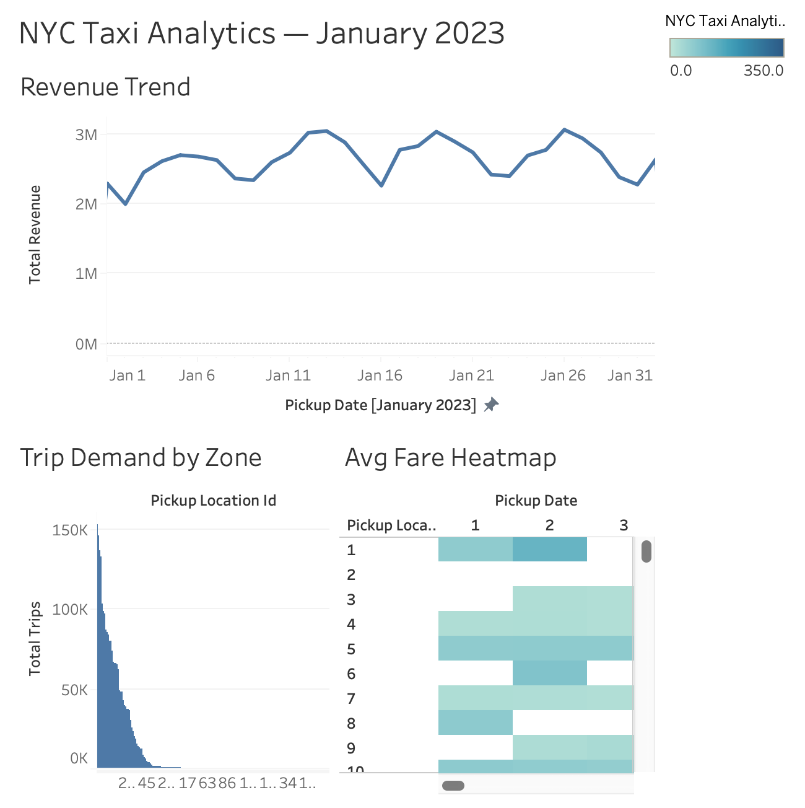

# NYC Taxi Analytics Platform
### Production-Grade ELT Pipeline · Airflow · dbt · BigQuery · Docker · Tableau


---

## Overview

End-to-end batch ELT pipeline ingesting NYC Yellow Taxi trip data into BigQuery, orchestrated with Apache Airflow, transformed with dbt, and visualized in Tableau.

**Dataset:** NYC TLC Yellow Taxi Trips — January 2023 (~3M rows)

---

## Architecture

```
┌─────────────────────────────────────────────────────────┐
│                    Apache Airflow DAG                    │
│         (Dockerized · LocalExecutor · @daily)           │
└──────────┬──────────────┬──────────────┬────────────────┘
           │              │              │
           ▼              ▼              ▼
    ingest_raw_data   dbt_run       dbt_test
           │              │              │
           ▼              ▼              ▼
┌─────────────────────────────────────────────────────────┐
│                      BigQuery                           │
│                                                         │
│  nyc_taxi_raw          nyc_taxi_analytics               │
│  └─ yellow_trips_raw   ├─ stg_yellow_trips (view)       │
│                        ├─ mart_daily_taxi_summary       │
│                        └─ dim_taxi_zones_scd2           │
└─────────────────────────────────────────────────────────┘
           │
           ▼
      Tableau Public Dashboard
```

---

## Tech Stack

| Layer | Technology |
|---|---|
| Orchestration | Apache Airflow 2.7 (Docker Compose) |
| Transformation | dbt 1.8 + dbt-bigquery |
| Data Warehouse | Google BigQuery (free tier) |
| Ingestion | Python · pandas · google-cloud-bigquery |
| Containerization | Docker Compose |
| Visualization | Tableau Public |

---

## Pipeline DAG

The Airflow DAG runs `@daily` and executes three tasks in sequence. If any task fails, downstream tasks are automatically skipped — preventing bad data from reaching the analytics layer.

```
ingest_raw_data >> run_dbt_models >> run_dbt_tests
```

- **ingest_raw_data** — downloads NYC TLC parquet (~500MB), loads 3M rows to BigQuery raw layer
- **run_dbt_models** — builds staging view + marts table in BigQuery
- **run_dbt_tests** — runs 23 data quality tests across all models

### Airflow DAG — All Tasks Successful



### Pipeline Run History



---

## dbt Model Lineage

Three-layer transformation architecture: raw → staging → marts, with a parallel SCD Type 2 dimension track.

### dbt Lineage Graph



```
Source: nyc_taxi_raw.yellow_trips_raw (3,066,766 rows)
    │
    ▼
staging.stg_yellow_trips (view) — 2,989,774 rows after filtering
    │   • Renamed columns to snake_case
    │   • Cast timestamps and numeric types
    │   • Filtered invalid trips (zero distance, negative fares, impossible durations)
    │   • Derived trip_duration_minutes
    │
    ▼
marts.mart_daily_taxi_summary (table) — 6,486 rows
        • Aggregated by pickup_date + pickup_location_id
        • Metrics: total_trips, avg_fare, total_revenue, credit_card_trips, cash_trips

seeds.taxi_zone_lookup (265 zones)
    │
    ▼
snapshots.dim_taxi_zones_scd2
        • Type 2 SCD tracking historical zone/borough changes
        • Columns: dbt_valid_from, dbt_valid_to, dbt_is_current
```

---

## dbt Test Coverage

23 data quality tests across staging and marts layers — all passing.

| Test Type | Count | What It Checks |
|---|---|---|
| not_null | 18 | Critical columns never null (pickup_datetime, fare_amount, etc.) |
| accepted_values | 2 | vendor_id ∈ {1,2}, payment_type ∈ {0,1,2,3,4} |
| Custom (assert_positive_fare) | 1 | All fare amounts > 0 |
| Source freshness | 2 | Raw data is up to date |
| **Total** | **23** | |

### 23/23 Tests Passing



---

## Data Warehouse Structure

BigQuery project organized into clearly separated datasets by layer.

### BigQuery Dataset Structure



### Analytics Table Preview — mart_daily_taxi_summary



---

## Dashboard

📊 [NYC Taxi Analytics — January 2023 on Tableau Public](https://public.tableau.com/app/profile/shivani.rao/viz/NYCTaxiAnalyticsJanuary2023/NYCTaxiAnalyticsJanuary2023?publish=yes)

Three interactive views built on the `mart_daily_taxi_summary` table:

- **Revenue Trend** — daily total revenue across January 2023, showing clear weekly patterns (~$2M Sundays, ~$3M Fridays)
- **Trip Demand by Zone** — total trips ranked by pickup location ID, identifying the busiest zones
- **Avg Fare Heatmap** — average fare by zone × day, highlighting airport zones with consistently higher fares

### Dashboard Preview



---

## Key Results

| Metric | Value |
|---|---|
| Raw rows ingested | 3,066,766 |
| Cleaned rows (after filtering) | 2,989,774 |
| Bad rows removed | ~77,000 |
| Final mart rows | 6,486 (daily × zone) |
| dbt tests passing | 23/23 |
| Pipeline schedule | @daily |
| Avg pipeline duration | ~1 min 27 sec |

---

## Project Structure

```
airflow-dbt-bq-pipeline/
├── airflow/
│   ├── dags/
│   │   └── nyc_taxi_pipeline.py      # Main Airflow DAG
│   ├── logs/
│   └── plugins/
├── dbt/
│   ├── models/
│   │   ├── staging/
│   │   │   ├── stg_yellow_trips.sql  # Staging model
│   │   │   ├── schema.yml            # Column docs + tests
│   │   │   └── sources.yml           # Source definitions
│   │   └── marts/
│   │       └── mart_daily_taxi_summary.sql  # Analytics mart
│   ├── snapshots/
│   │   └── dim_taxi_zones_scd2.sql   # SCD Type 2 snapshot
│   ├── seeds/
│   │   └── taxi_zone_lookup.csv      # Zone reference data
│   ├── macros/
│   │   └── generate_schema_name.sql  # Custom schema macro
│   ├── dbt_project.yml
│   └── profiles.yml
├── scripts/
│   ├── ingest_to_bigquery.py         # Raw data ingestion
│   └── setup_bigquery.py             # Dataset setup
├── infra/
│   ├── docker-compose.yml            # Airflow stack
│   └── .env.example                  # Environment template
├── docs/
│   └── screenshots/                  # UI screenshots
└── README.md
```

---

## Setup

### Prerequisites
- Docker Desktop
- Python 3.9+
- Google Cloud account (free tier)
- dbt-bigquery (`pip install dbt-bigquery`)

### Run Locally

```bash
# 1. Clone the repo
git clone https://github.com/Shivanirao2000/airflow-dbt-bq-pipeline
cd airflow-dbt-bq-pipeline

# 2. Set up environment
cp infra/.env.example infra/.env
# Fill in: GCP_PROJECT_ID, GCP_KEYFILE_PATH, AIRFLOW__CORE__FERNET_KEY, AIRFLOW__WEBSERVER__SECRET_KEY

# 3. Start Airflow
cd infra
docker-compose up airflow-init
docker-compose up -d

# 4. Run dbt manually
cd ../dbt
export GCP_PROJECT_ID=your-project-id
dbt run
dbt test

# 5. Trigger full pipeline via Airflow UI
# Open http://localhost:8080 → login admin/admin
# Enable nyc_taxi_pipeline DAG → click Trigger DAG ▶
```

### Generate dbt Docs

```bash
cd dbt
dbt docs generate
dbt docs serve --port 8081
# Open http://localhost:8081 to view lineage graph and column documentation
```